# 🏨 Hotel Data Analytics

An end-to-end **Hotel Data Analytics project** focused on analyzing hotel bookings, revenue, guests, rooms, payments, and reviews using **SQL, Python, Excel, and Power BI**.

The project combines data analysis, database querying, visualization, data validation, and business insights to understand hotel performance and support data-driven decisions.

---

## 📌 Project Overview

This project analyzes hotel booking data to answer important business questions related to:

* Revenue and booking performance
* Monthly revenue trends
* Booking channels
* Cancellation rates
* Room type performance
* Guest behavior
* Payment methods
* Review ratings
* Guest countries
* High-value guests
* Data quality and validation
* Correlation between numerical variables

The project follows a complete analytics workflow from **database design and SQL analysis to Python exploration and Power BI visualization**.

---

## 🎯 Project Objectives

The main objectives of this project are:

* Analyze total revenue and booking performance.
* Identify monthly revenue trends.
* Find the highest-performing room types.
* Compare booking channels.
* Analyze cancellation rates.
* Identify top guests by total spending.
* Analyze guest countries.
* Examine payment methods and review ratings.
* Validate data quality using SQL.
* Analyze correlations between numerical variables.
* Build an interactive Power BI dashboard.
* Generate useful business insights and recommendations.

---

## 🛠️ Tools & Technologies

| Tool           | Purpose                                                    |
| -------------- | ---------------------------------------------------------- |
| **SQL Server** | Database creation, querying, analysis, and data validation |
| **Python**     | Data analysis and visualization                            |
| **Pandas**     | Data manipulation and analysis                             |
| **Matplotlib** | Data visualization                                         |
| **Seaborn**    | Statistical visualization and correlation heatmap          |
| **Excel**      | Data analysis and Pivot Tables                             |
| **Power BI**   | Interactive dashboard and business intelligence            |
| **GitHub**     | Project version control and documentation                  |

---

## 🔄 Project Workflow

```text
Raw Data
   ↓
Database Design
   ↓
SQL Server
   ↓
Data Quality Checks
   ↓
Excel Analysis
   ↓
Python Analysis
   ↓
Power BI Dashboard
   ↓
Business Insights
   ↓
Recommendations
```

---

# 🗄️ Database Design

The project database contains **5 main tables**:

* `guests`
* `rooms`
* `bookings`
* `payments`
* `reviews`

### Main Structure

* `bookings` is the main fact table.
* `guests` and `rooms` act as dimension tables.
* `payments` and `reviews` are linked to bookings.

### Relationships

The database contains **4 main relationships**:

```text
Guests
   │
   └──────< Bookings >────── Rooms
                  │
                  ├──────< Payments
                  │
                  └──────< Reviews
```

### Database Size

| Table    | Records |
| -------- | ------: |
| Guests   |   5,000 |
| Bookings |  20,000 |
| Rooms    |     100 |
| Payments |  25,000 |
| Reviews  |  15,000 |

---

# 🧮 SQL Server Analysis

SQL Server was used for both **business analysis** and **data validation**.

## Analytical Queries

The SQL analysis includes:

1. Total booking value, total bookings, and average booking value
2. Monthly revenue trend
3. Top 5 room types by revenue
4. Revenue, bookings, and average booking value by booking channel
5. Cancellation rate by booking channel
6. Top 10 guests by total spending
7. Revenue and average booking value by room type
8. Top 10 countries by number of guests
9. High-value guests using a CTE
10. Monthly revenue growth using `LAG()`

## Data Quality Checks

The project includes **11 SQL data quality checks**, including:

* Duplicate guest IDs
* NULL values
* Invalid booking dates
* Invalid number of nights
* Invalid review ratings
* Room capacity validation
* Orphan guest records
* Orphan room records
* Orphan payment records
* Orphan review records

---

# 🐍 Python Analysis

Python was used for exploratory data analysis and visualization.

The analysis was performed using:

* **Pandas**
* **Matplotlib**
* **Seaborn**
* **Google Colab**

## Python Analysis Areas

### Revenue Analysis

* Total booking value
* Average booking value
* Booking value by year
* Monthly booking value
* Highest booking-value month

### Booking Analysis

* Total bookings
* Monthly bookings
* Bookings by status
* Bookings by year

### Booking Channel Analysis

* Number of bookings by channel
* Booking value by channel
* Average booking value by channel

### Cancellation Analysis

* Overall cancellation rate
* Cancellation rate by booking channel

### Room Type Analysis

* Available room types
* Booking value by room type
* Number of bookings by room type
* Average booking value by room type

### Guest Analysis

* Top 10 guests by booking value
* Guest information
* Guests by country
* Average booking value per guest

### Payment & Review Analysis

* Payment method distribution
* Review rating distribution

### Data Validation

* Valid guest relationships
* Number of nights validation

### Correlation Analysis

Numerical variables were analyzed using correlation analysis and visualized with a **heatmap**.

---

# 📊 Excel Analysis

Excel was used for additional analysis and summary reporting.

The analysis includes:

* Pivot Tables
* Revenue analysis
* Booking analysis
* Room type analysis
* Booking channel analysis
* Summary metrics

---

# 📈 Power BI Dashboard

Power BI was used to create an interactive **Hotel Analytics Dashboard**.

The dashboard contains:

* **2 Overview pages**
* **1 Insights page**

### Power BI Model

The model contains:

* 4 relationships
* 4 calculated columns
* 8 DAX measures

### Main KPIs

* Total Revenue: **192.2M**
* Total Guests: **5K**
* Total Bookings: **20K**
* Total Rooms: **100**
* Average Room Price: **1.83K**

The dashboard provides an interactive view of hotel performance across revenue, bookings, guests, rooms, and booking channels.

---

# 📸 Project Screenshots

## 📊 Power BI Dashboard

### Overview 1

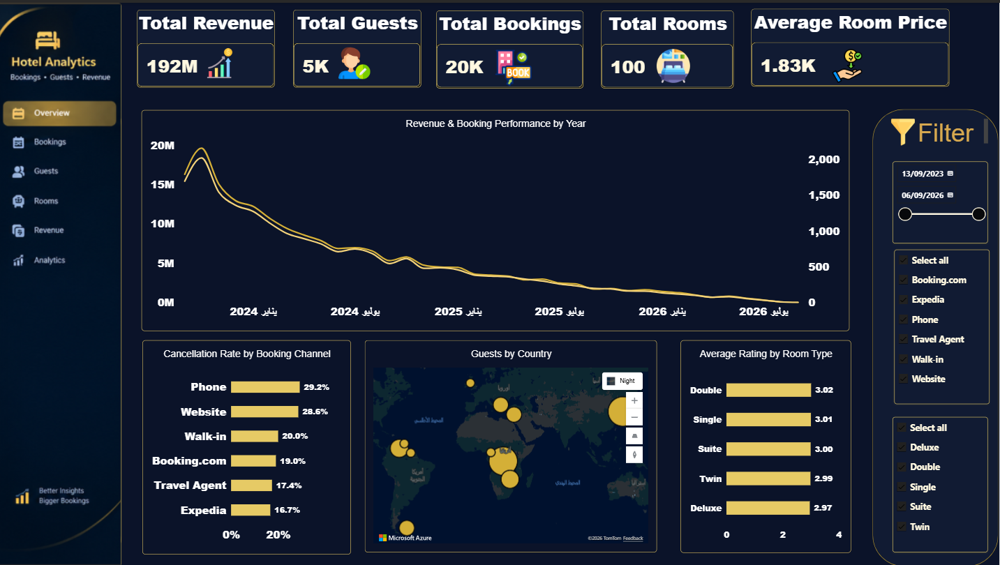

### Overview 2

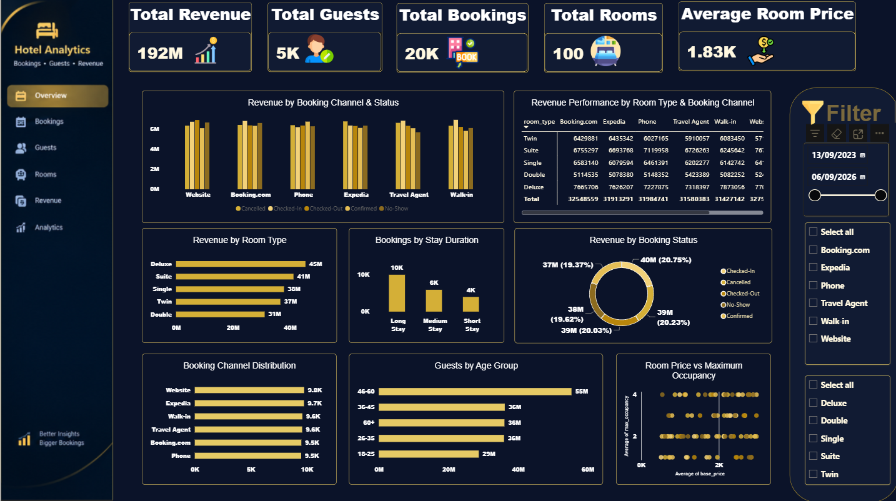

### Insights

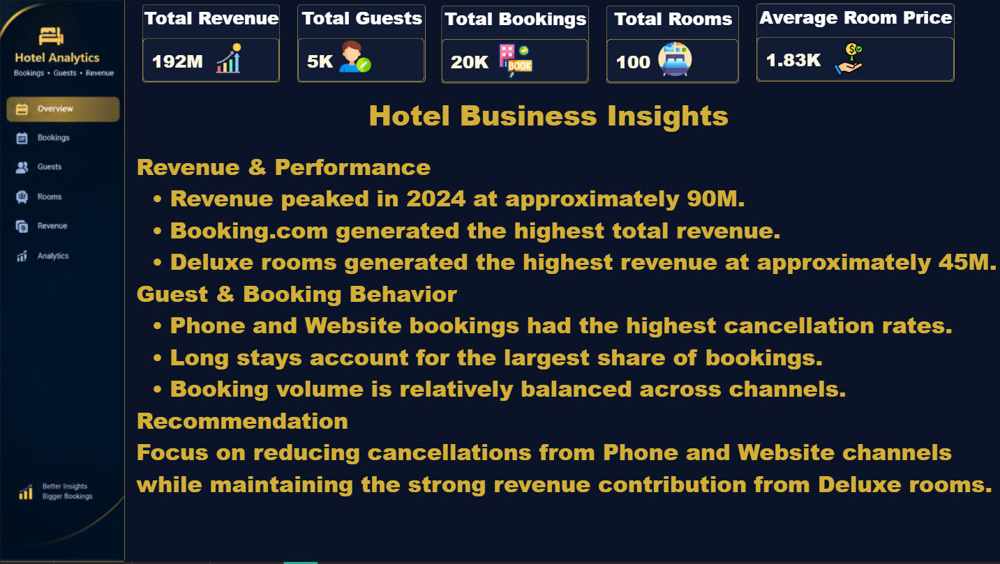

---

## 🗄️ Database ERD

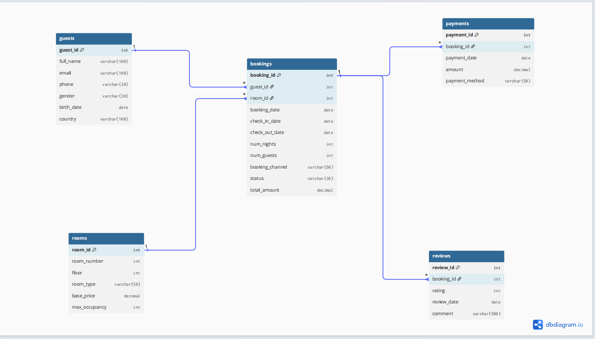

---

## 🐍 Python Analysis

### Python Analysis 1

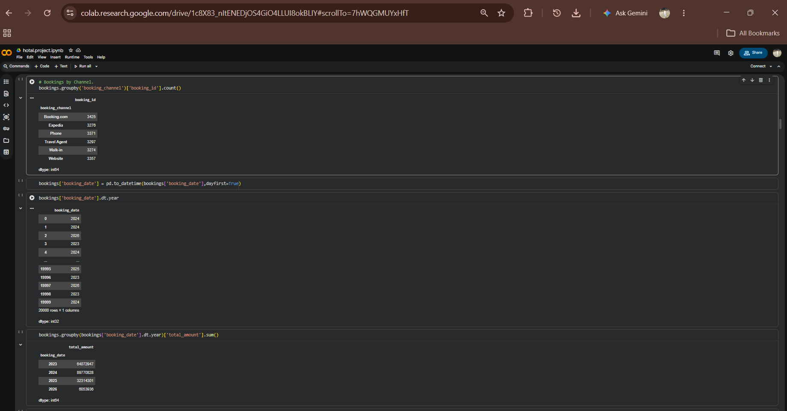

### Python Analysis 2

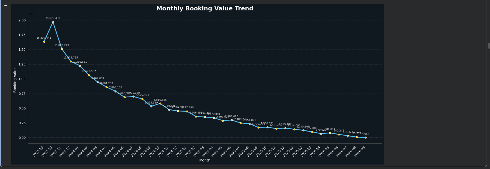

---

## 🧮 SQL Analysis

### SQL Queries 1


### SQL Queries 2

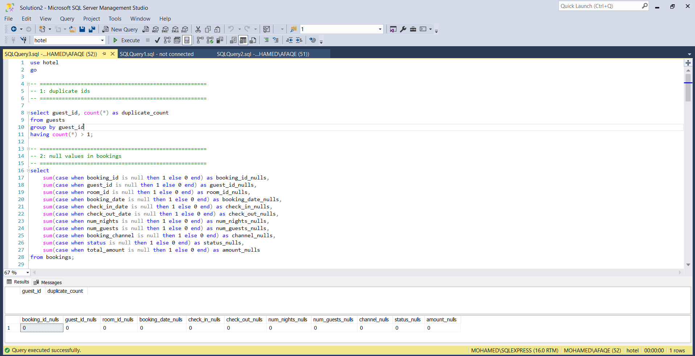

### SQL Queries 3

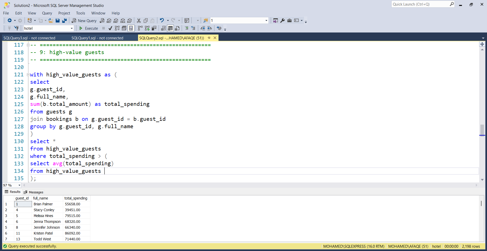

### SQL Queries 4

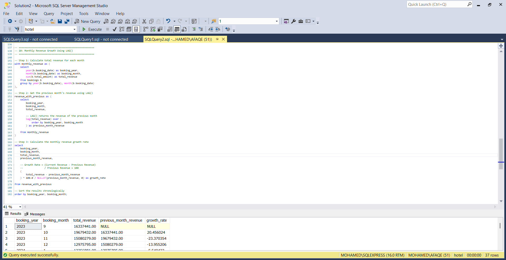

---

## 📊 Excel Analysis

### Excel Analysis 1

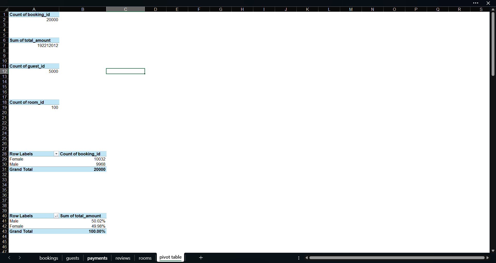

### Excel Analysis 2

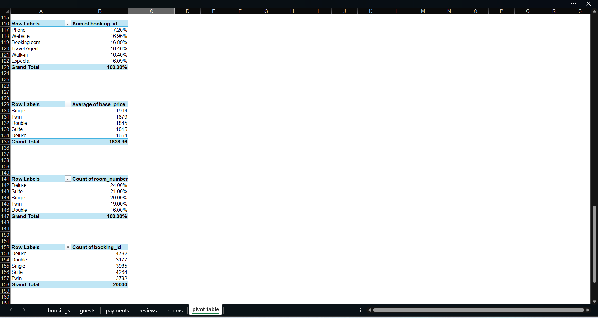

---

# 📌 Key Findings

## 💰 Revenue & Performance

* Total booking revenue reached approximately **192.2M**.
* Average booking value was approximately **9.6K**.
* Revenue peaked in **2024**, reaching approximately **90M**.
* **Deluxe rooms** generated the highest revenue at approximately **45.4M**.
* Booking channel revenue was relatively balanced, ranging from approximately **31.4M to 32.8M**.

## 👥 Guest & Booking Behavior

* Total bookings reached approximately **20K**.
* The overall cancellation rate was approximately **20.2%**.
* **Phone** and **Website** bookings had the highest cancellation rates.
* The top guest generated approximately **159K** in total spending.
* Average spending per guest was approximately **39K**.
* **Korea** was the top country by number of guests, with approximately **40 guests**.

## 📈 Correlation Analysis

The strongest observed correlation was approximately **0.74** between:

* `num_nights`
* `total_amount`

This indicates a strong positive relationship between the length of stay and total booking value.

---

# 💡 Business Recommendations

### 1. Reduce Cancellation Rates

Focus on booking channels with higher cancellation rates, especially **Phone** and **Website**, by introducing:

* Better confirmation processes
* Cancellation policies
* Deposits for selected bookings
* Reminder notifications

### 2. Improve Room Revenue

Since **Deluxe rooms** generated the highest revenue, the hotel can:

* Promote Deluxe rooms
* Create room upgrade offers
* Bundle Deluxe rooms with additional services

### 3. Focus on High-Value Guests

High-value guests can be targeted with:

* Loyalty programs
* Personalized offers
* Room upgrades
* Special packages

### 4. Increase Revenue Through Longer Stays

Since `num_nights` has a strong positive correlation with `total_amount`, the hotel can encourage longer stays through:

* Long-stay discounts
* Weekly packages
* Extended-stay promotions

---

# 📁 Project Structure

```text
Hotel-Data-Analytics/
│
├── Excel/
│   └── Hotel_Analysis.xlsx
│
├── SQL/
│   ├── Database/
│   │   └── hotel_database.sql
│   │
│   ├── Queries/
│   │   ├── 01_Basic_Analysis.sql
│   │   ├── 02_Booking_Analysis.sql
│   │   └── 03_Advanced_Analysis.sql
│   │
│   ├── Data_Quality/
│   │   └── 01_Data_Quality_Checks.sql
│   │
│   └── Reports/
│       └── SQL_Analysis_Report.md
│
├── Python/
│   └── Hotel_Analytics.ipynb
│
├── PowerBI/
│   └── Hotel_Analytics.pbix
│
├── ERD/
│
├── Presentation/
│
├── Screenshots/
│   ├── erd.png
│   ├── excel_analysis.png
│   ├── excel_analysis_1.png
│   ├── excel_analysis_2.png
│   ├── powerbi_insights.png
│   ├── powerbi_overview_1.png
│   ├── powerbi_overview_2.png
│   ├── python_analysis_1.png
│   ├── python_analysis_2.png
│   ├── sql_queries_1.png
│   ├── sql_queries_2.png
│   ├── sql_queries_3.png
│   └── sql_queries_4.png
│
└── README.md
```

---

# 🏁 Project Outcome

This project demonstrates an end-to-end **Data Analytics workflow**, starting from database design and SQL querying through Python analysis, Excel reporting, and Power BI dashboard development.

It combines:

**SQL + Python + Excel + Power BI + Data Visualization + Data Validation + Business Analysis**

The final result is a complete hotel analytics project designed to transform raw booking data into meaningful business insights and actionable recommendations.

---

# 👨‍💻 Author

**Mohamed Fathy**

Computer Science Student — Nahda University

**Data Analytics | Machine Learning | Data Science**
